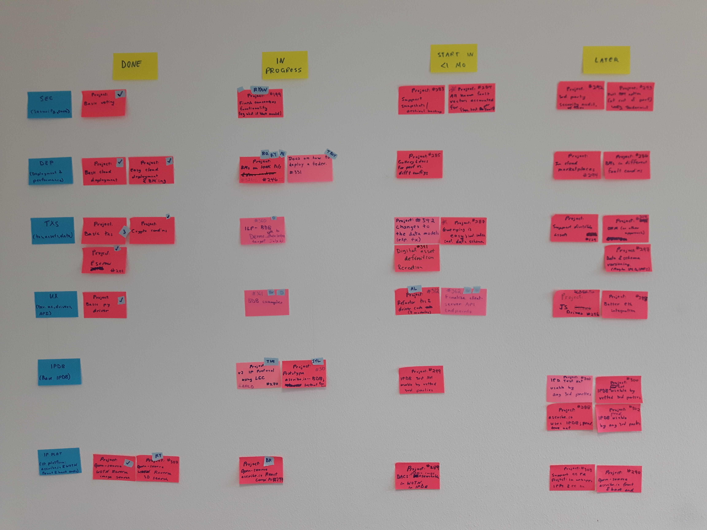

# BigchainDB Roadmap

This is a high-level roadmap for BigchainDB and allied projects. We use [a waffle.io board](https://waffle.io/bigchaindb/org/) to get a high-level view of all relevant repositories on GitHub (currently bigchaindb/bigchaindb, bigchaindb/org, bigchaindb/cryptoconditions, and bigchaindb/bigchaindb-examples). There are five columns on the waffle.io board; here's what they mean:

* **Backlog**: Open issues and new pull requests opened by non-collaborators
* **Project in future**: PRs & issues with the "2) Project in future" label
* **Project in 1 mo**: PRs & issues with the "1) Project in 1 mo" label
* **In Progress**: PRs & issues with the "0) Project in progress" label, issues referenced by a branch name, and new pull requests opened by collaborators
* **Done**: Issues closed in the last week

You can filter that board by label, who is assigned, milestone, and source repo. Here are some filter shortcuts for specific labels:

* [SEC](http://tinyurl.com/jxlvea4) (security, core)
* [D&P](http://tinyurl.com/j3ag2d4) (deployment, performance)
* [TXS](http://tinyurl.com/hm4ea7p) (assets, data)
* [UX](http://tinyurl.com/zptzep2) (docs, drivers, API)
* [IPDB](http://tinyurl.com/ha6lp8c)
* [IP PLAT](http://tinyurl.com/hnd26as) (ascribe.io, WOTN)

At the time of writing, you can't filter to get all PRs & issues with the "2) Project in future" label because that label is used to define a column. It's [a known waffle.io bug](https://github.com/waffleio/waffle.io/issues/2327). It's not a big problem, because if you want to see all the PRs & issues with that label, you can just look in the **Project in future** column. The same is true of other columns defined by labels.

## Some Repository-Specific GitHub Links

| **Repository** | **Open issues** | **Open PRs** | **Milestones** |  
|----------------|-----------------|--------------|----------------|
| bigchaindb/bigchaindb | [Open issues](https://github.com/bigchaindb/bigchaindb/issues) | [Open PRs](https://github.com/bigchaindb/bigchaindb/pulls) | [Milestones](https://github.com/bigchaindb/bigchaindb/milestones) |
| bigchaindb/org | [Open issues](https://github.com/bigchaindb/org/issues) | [Open PRs](https://github.com/bigchaindb/org/pulls) | NA |
| bigchaindb/cryptoconditions | [Open issues](https://github.com/bigchaindb/cryptoconditions/issues) | [Open PRs](https://github.com/bigchaindb/cryptoconditions/pulls) | NA |
| bigchaindb/bigchaindb-examples | [Open issues](https://github.com/bigchaindb/bigchaindb-examples/issues) | [Open PRs](https://github.com/bigchaindb/bigchaindb-examples/pulls) | NA |

## Physical Planning Board

Below is a photo the physical planning board in the ascribe office. We aim to update it weekly.

